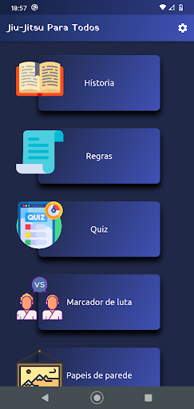
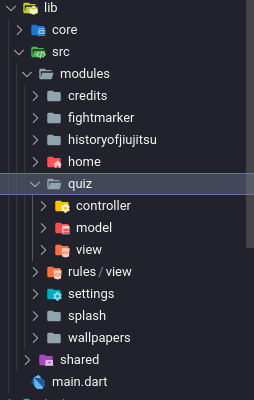
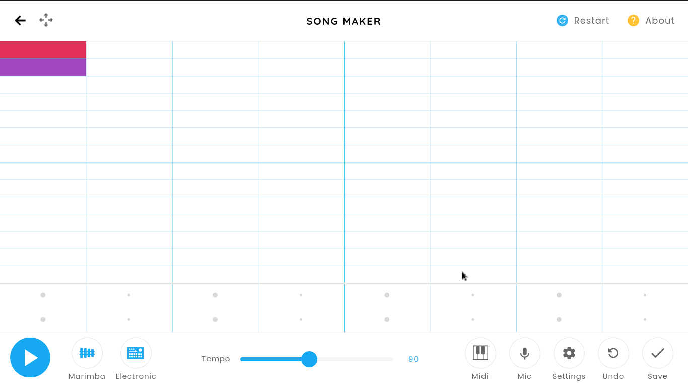
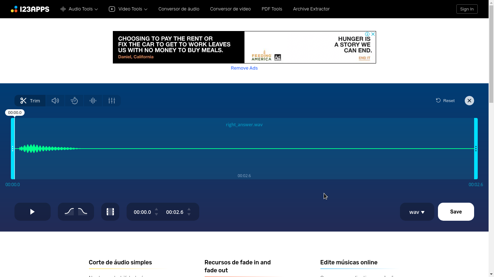
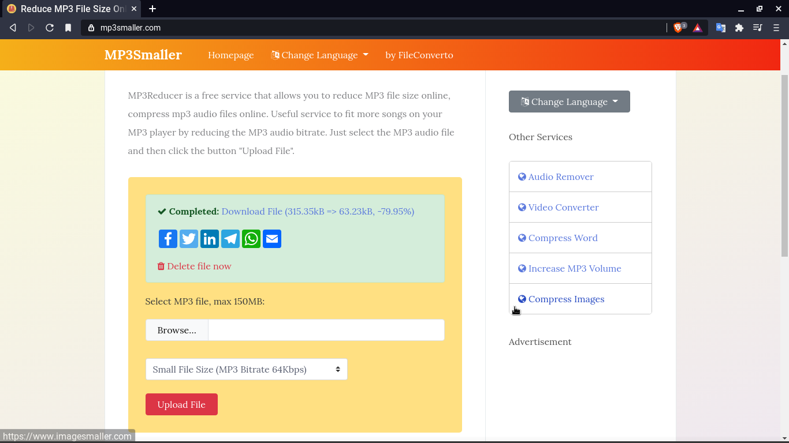
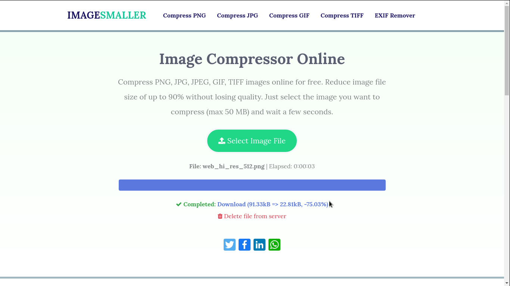
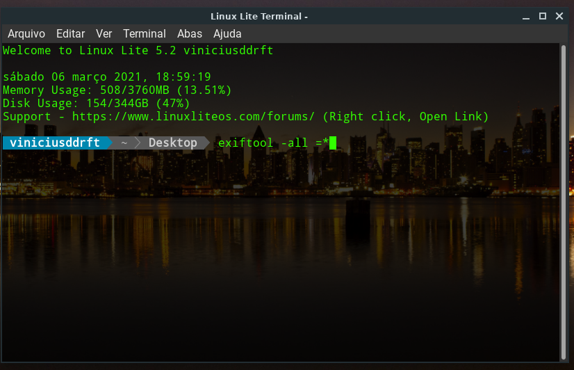

# jiu_jitsu_para_todos

## [Link para download na Google play](https://play.google.com/store/apps/details?id=com.jiu_jitsu_para_todos)

Um aplicativo de jiu-jitsu feito em flutter.

Caso queira conhecer mais sobre o flutter:

- [Lab: Write your first Flutter app](https://flutter.dev/docs/get-started/codelab)
- [Cookbook: Useful Flutter samples](https://flutter.dev/docs/cookbook)
- [online documentation](https://flutter.dev/docs)

## O objetivo desse repositório é mostrar e documentar minha primeira experiencia ao criar um app

 
Aceito qualquer critica construtiva ou contribuição primeiramente gostaria de dizer que alguns arquivos não foram colocados no repositório por ter informações sensíveis, porem todo o código que foi restrito era em relação aos anúncios na admob ou configurações da loja Google play, mas ainda tem tudo que eu fiz para construir o aplicativo aqui.
  

Abaixo tenho a tela da home

# Arquitetura MVC

OBS:mvc significa Model, View e Controller é uma arquitetura de codigo que separa o codigo em 3 camadas

- A camada de interação do usuário(view).
- A camada de manipulação dos dados(model).
- A camada de controle(controller).
   
Todo o app foi feito usando a arquitetura mvc os models foram usados para armazenar todas questões do quiz e também os wallpapers usados no futuro pretendo fazer um servidor para lidar com isso e dar mais qualidade ao app mas de começo eu quis dar o pontapé inicial com armazenamento local por que eram poucos dados e também mais fácil para começar. Os controller fazem todo controle de dados entre os models e a views, no quiz especificamente ele embaralha toda ordem das questões e das opções de cada questão, tenho também um controller para lidar com os anúncios e id de cada anuncio. Os views são toda parte visual do meu aplicativo, mas no meio das minhas views também existe um pouco das regras de negocio isso foi uma consequência por ter escolhido usar o Setstate como reatividade, não acredito que isso seja algo ruim mas quero sim aprender futuramente a gerenciar o estado de outras formas, e mudar isso no app.
   
imagem da minha estrutura MVC: 

# Testes unitários

Foi uma novidade para mim fazer testes unitários e por mais que no começo eu me enrolava muito eu também gostei muito de fazer isso, tenho testes unitários para o quiz que verifica se ele trouxe as questões corretas e de forma aleatória e um outro teste para ver se o controller dos wallpapers retornava o path corretamente.

Para rodar os teste basta usar -> flutter test

   

# Sons

Todos sons do app foram criados por mim no site -> [Song Maker](https://musiclab.chromeexperiments.com/Song-Maker)

  
abaixo é como o som de quando você acerta uma questão foi feito:  

   
Depois de fazer os sons eu precisava cortar e deixar a arquivo menor e fiz isso no site -> [MP3cut](https://mp3cut.net/pt/)
  

   
depois disso eu já tenho o som em MP3 e só preciso reduzir mais ainda seu tamanho sem perder a qualidade para otimizar o app, e isso foi feito no site -> [MP3Smaller](https://www.mp3smaller.com/)
  

  
E com isso o som ficou 79,95% mais leve e assim o som já estava pronto para ser usado, esse processo foi o mesmo para todos os sons do app.
  

# imagens

todos os icones do aplicativo são do site -> [Flaticon](https://www.flaticon.com/br/)

Alguns como o Ícone principal eu precisei usar o gimp para ajustar algumas coisas e também nos ícones de faixa branca e azul. já os wallpapers foram tirados de alguns sites que tem imagens gratuitamente como pixabay, unsplash e alguns outros.

eu também otimizei cada imagem reduzindo o tamanho delas no site -> [Imagemaller](https://www.imagesmaller.com/)
  

  
Nesse print foi reduzido 75,03% da imagem sem perder qualidade e isso já ajuda muito na otimização, esse processo foi feito para todas imagens.
  

# Limpando midias

No final para usar cada imagens ou som eu retirei todos metadados dos arquivos para otimizar nem que seja só um pouco a mais.
  

  

# fim

Essa foi minha jornada criando meu primeiro app, foi muito desafiador no começo eu ainda estava na incerteza se iria conseguir mas deu tudo certo e me trouxe muito aprendizado em varias coisas.
