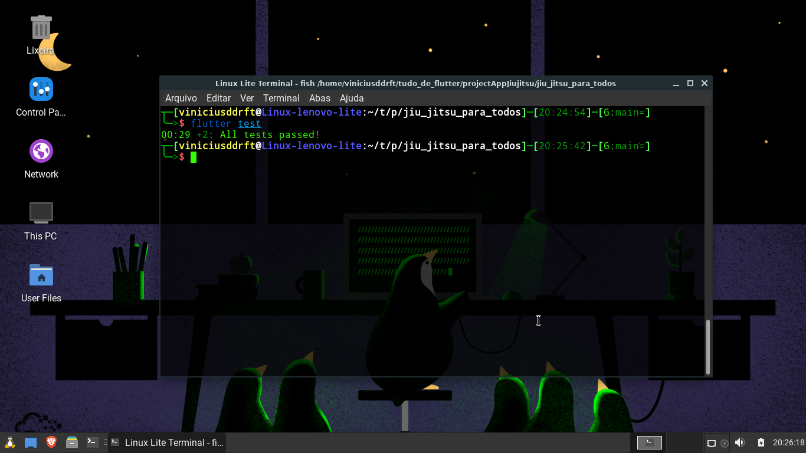

# jiu_jitsu_para_todos

## [Link para download na Google play](https://play.google.com/store/apps/details?id=com.jiu_jitsu_para_todos)

Um aplicativo de jiu-jitsu feito em flutter.

Caso queira conhecer mais sobre o flutter:

- [Lab: Write your first Flutter app](https://flutter.dev/docs/get-started/codelab)
- [Cookbook: Useful Flutter samples](https://flutter.dev/docs/cookbook)
- [online documentation](https://flutter.dev/docs)

## O objetivo desse repositório é mostrar e documentar minha primeira experiencia ao criar um app

 
Bom eu refatorei esse meu primeiro app, ele estava em uma arquitetura mvc meio que adaptado do que eu conhecia na epoca quando comecei isso não sabia como fazer da melhor forma e hoje fico muito feliz de voltar nesse projeto refatorando ele inteiro e deixando em uma arquitetura muito boa e que essa sim é pensada e construida para o flutter.
  

Abaixo tenho a tela da home

# Arquitetura Minicore

OBS: arquitetura criada pela flutterando

## [Minicore](https://github.com/Flutterando/minicore)

   
Todo o app segue a arquitetura minicore separando cada feature em 3 camadas a ui que é a tela em si a interector que nessa camada vai ficar toda parte de estados entidades e interfaces que a camada data ira implementar a camada de data por sua vez é a camada que fornece os dados sejam eles vindo de uma api ou um local storage essa camada usa o padrão adapter para tornar mais fácil a manutenção e mudança de comunicação com a api, essa arquitetura separa muito bem a ui que é basicamente onde fica o código flutter ou seja todo parte visual, da parte de regra de negocios que fica nos interector e essa camada tambéms está praticamente desacoplada da camada que recebe os dados, apesar de ser simples é fascinante.
   
imagem da minha estrutura MVC: 

# Testes

Estou refazendo todos os testes, migrei ele muito rápido e só faltou isso.

   

# Sons

Todos sons do app foram criados por mim no site -> [Song Maker](https://musiclab.chromeexperiments.com/Song-Maker)

  
abaixo é como o som de quando você acerta uma questão foi feito:  

   
Depois de fazer os sons eu precisava cortar e deixar a arquivo menor e fiz isso no site -> [MP3cut](https://mp3cut.net/pt/)
  

   
depois disso eu já tenho o som em MP3 e só preciso reduzir mais ainda seu tamanho sem perder a qualidade para otimizar o app, e isso foi feito no site -> [MP3Smaller](https://www.mp3smaller.com/)
  

  
E com isso o som ficou 79,95% mais leve e assim o som já estava pronto para ser usado, esse processo foi o mesmo para todos os sons do app.
  

# imagens

todos os icones do aplicativo são do site -> [Flaticon](https://www.flaticon.com/br/)

Alguns como o Ícone principal eu precisei usar o gimp para ajustar algumas coisas e também nos ícones de faixa branca e azul. já os wallpapers foram tirados de alguns sites que tem imagens gratuitamente como pixabay, unsplash e alguns outros.

eu também otimizei cada imagem reduzindo o tamanho delas no site -> [Imagemaller](https://www.imagesmaller.com/)
  

  
Nesse print foi reduzido 75,03% da imagem sem perder qualidade e isso já ajuda muito na otimização, esse processo foi feito para todas imagens.
  

# Limpando midias

No final para usar cada imagens ou som eu retirei todos metadados dos arquivos para otimizar nem que seja só um pouco a mais.
  

  

# fase atual

reecrevendo os testes, app finalmente migrado para firebase e agora de arquitetura nova
